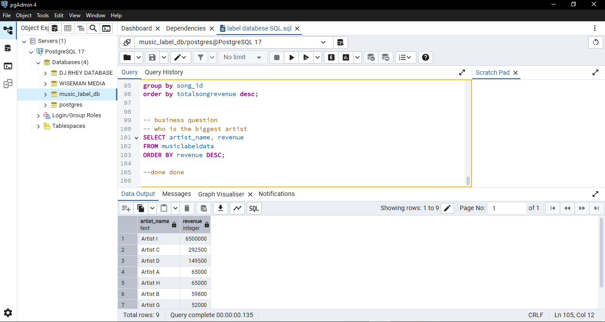

# sql-musiclabel-analysis
SQL analysis of music label dataset using PostgreSQL

## 📊 SQL Music Label Analysis

This project analyzes a simulated music label dataset using SQL in PostgreSQL.

### 🔹 Skills Used:
- SQL
- Data Analysis
- Aggregations (SUM, COUNT)
- Filtering (WHERE)
- Sorting (ORDER BY)
- Grouping (GROUP BY)

### 🔹 Key Questions Answered:
- What is the highest revenue song?
- Who is the top-performing artist?
- How many songs does each artist have?
- Which songs generate high revenue?

### 🔹 Tools Used:
- PostgreSQL
